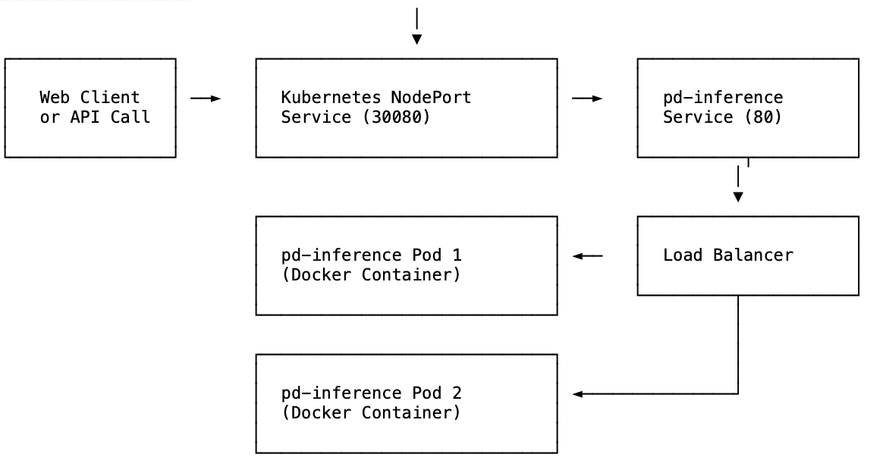
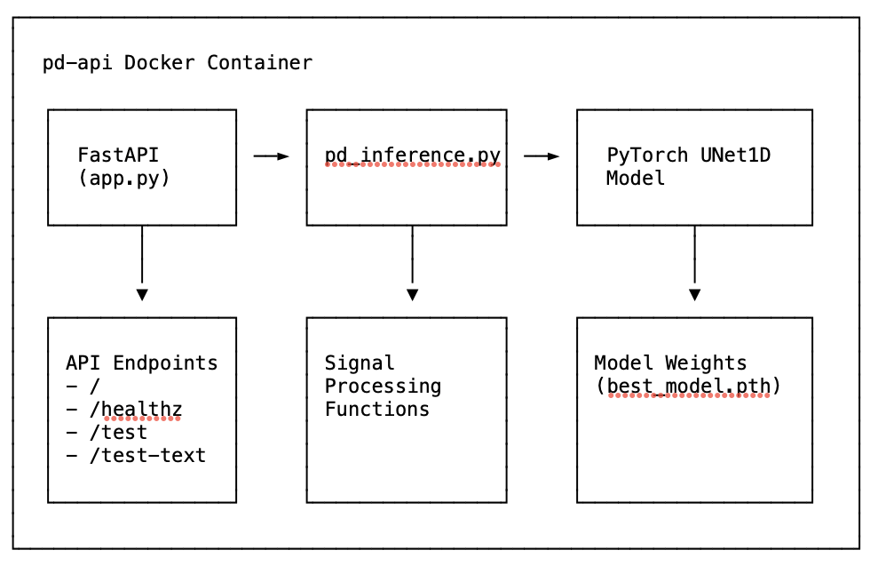
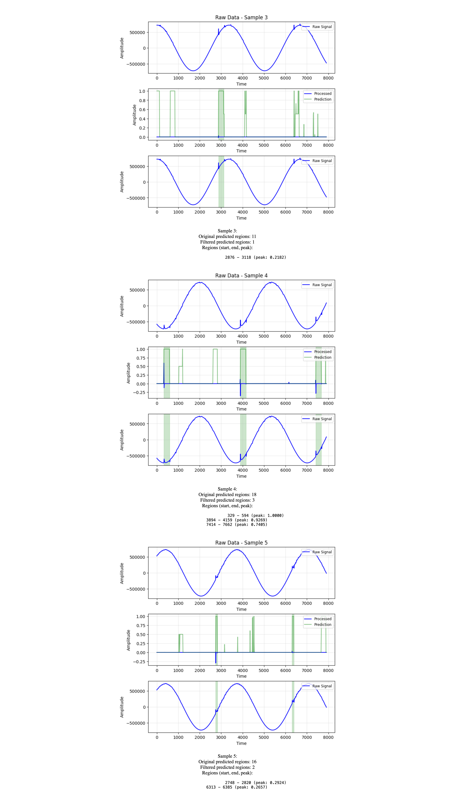

# PD Inference API

This API provides Partial Discharge (PD) signal analysis and inference capabilities. The service processes high-frequency signal data using a PyTorch UNet1D model to detect anomalies that might indicate equipment failure in high voltage systems.

## Purpose

The system is designed for high voltage equipment diagnostics, providing a reliable way to detect partial discharges - electrical sparks that can indicate insulation problems before they cause catastrophic failures. The API provides both visual and text-based output to help identify these issues early.

## Model Architecture

The implementation uses model weights (`best_model.pth`) rather than the entire model for the following reasons:

1. Efficiency - the weights file is ~48MB while a full model save would be >150MB
2. Smaller Docker image for faster deployments
3. Model architecture defined in code (`pd_inference.py`) for easier adaptation
4. Standard practice for PyTorch model deployment - define architecture and load weights

This approach provides more flexibility while keeping the deployment footprint small.

## System Architecture & Analysis

### Client Request Flow



### Container Architecture



### Resource Allocation

- CPU: 1-2 cores per pod (2 pods)
- Memory: 2-4GB per pod (2 pods) 
- Model Cache: 1GB in-memory volume
- Storage: Container image ~1.61GB

### Scaling Strategy

The application uses a multi-layered scaling approach:

1. **Container-level parallelism**
   - Configured worker threads: 4 (via WORKER_THREADS)
   - PyTorch thread control: 4 (via TORCH_NUM_THREADS)
   - OpenMP threads: 4 (via OMP_NUM_THREADS)
   - Maximum batch size: 8 (via MAX_BATCH_SIZE)

2. **Kubernetes-level scaling**
   - Static horizontal scaling with 2 replica pods
   - Anti-affinity rules to distribute across nodes
   - RollingUpdate strategy for zero-downtime deployments
   - Could be extended with Horizontal Pod Autoscaler (HPA)

3. **Performance-optimized configurations**
   - Memory-backed volume for model cache
   - Appropriate health probes with timing adjustments
   - Startup probe allowing for longer initialization

### Docker Container Performance

| Container Name | CPU % | Memory Usage | Network I/O | Disk I/O |
|---------------|-------|-------------|------------|----------|
| pd-pd-inference-api-1 | 0.24% | 244.2MiB / 7.65GB | 3.44kB/1.67kB | 1.43MB/815kB |
| pd-inference (k8s pod 1) | 0.28% | 275.7MiB / 4GB | minimal | 52.5MB/831kB |
| pd-inference (k8s pod 2) | 0.26% | 243.9MiB / 4GB | minimal | 9.8MB/815kB |

Key observations:
- Low CPU utilization during idle periods (~0.25%)
- CPU usage spikes to ~30-50% during inference (not shown in snapshot)
- Memory usage is stable at ~240-275MB, well within allocation limits
- Minimal network and disk I/O during normal operation

### Docker Images

| Image Name | Tag | Size | Created |
|------------|-----|------|---------|
| pd-pd-inference-api | latest | 1.61GB | 2025-06-01 19:09:00 +0200 |
| pd-api | latest | 1.61GB | 2025-06-01 19:09:00 +0200 |
| pd-inference | latest | 1.61GB | 2025-06-01 18:25:50 +0200 |

Container size optimization opportunities:
- Consider multi-stage Docker builds
- Remove unnecessary Python packages
- Use lighter base images like python:3.10-slim-bullseye

## Project Structure

```
├── api/                  # API code
│   ├── app.py            # FastAPI application
│   └── pd_inference.py   # Inference logic
├── docker/               # Docker-related files
│   └── Dockerfile        # Dockerfile for building the container
├── kubernetes/           # Kubernetes manifests
│   ├── deployment.yaml   # Kubernetes deployment configuration
│   └── service.yaml      # Kubernetes service configuration
├── resources/            # Resources needed by the application
│   ├── best_model.pth    # Trained model weights
│   └── test_dataa.npy    # Test data
├── docs/                 # Documentation files
├── deploy.sh             # Script to build and deploy to Kubernetes
├── run-local.sh          # Script to run locally with Docker Compose
├── docker-compose.yml    # Docker Compose configuration
├── requirements.txt      # Python dependencies
└── README.md             # Project documentation
```

## Prerequisites

- Docker Desktop with Kubernetes enabled (for Kubernetes deployment)
- kubectl command-line tool configured for your Kubernetes cluster
- Docker and Docker Compose for local development
- At least 4GB of available memory for the container

## Running Locally with Docker Compose

### Option 1: Using the provided script

The easiest way to run the application locally:

```bash
# Make the script executable (if needed)
chmod +x run-local.sh

# Run the script
./run-local.sh
```

### Option 2: Manual Docker Compose

```bash
# Build and start the container
docker-compose up --build -d

# Check the logs
docker-compose logs -f

# Stop the container when done
docker-compose down
```

The API will be available at http://localhost:8000

### Testing the local deployment

```bash
# Test the health check endpoint
curl -X GET http://localhost:8000/healthz

# Test the root endpoint
curl -X GET http://localhost:8000/

# Test the text-based analysis endpoint
curl -X GET http://localhost:8000/test-text

# Test the visual analysis endpoint (view in a browser)
open http://localhost:8000/test
```

## Running in Kubernetes

### Option 1: Using the deploy script (Recommended)

The easiest way to deploy to Kubernetes:

```bash
# Make the script executable (if needed)
chmod +x deploy.sh

# Run the deployment script
./deploy.sh
```

### Option 2: Manual deployment

Step-by-step manual deployment:

1. Build the Docker image:

```bash
docker build -t pd-api:latest -f docker/Dockerfile .
```

2. Verify the image was created:

```bash
docker images | grep pd-api
```

3. Apply the Kubernetes manifests:

```bash
kubectl apply -f kubernetes/deployment.yaml
kubectl apply -f kubernetes/service.yaml
```

4. Check the deployment status:

```bash
kubectl get deployments
kubectl get pods
kubectl get services
```

5. Wait for the deployment to be ready:

```bash
kubectl wait --for=condition=available --timeout=300s deployment/pd-inference
```

6. Since Kubernetes in Docker Desktop may not expose NodePort services directly, set up port-forwarding:

```bash
# Forward the service port to your local machine
kubectl port-forward service/pd-inference-service 8080:80
```

7. The service will be available at:

```
http://localhost:8080
```

### Testing the Kubernetes deployment

```bash
# Test the health check endpoint
curl -X GET http://localhost:8080/healthz

# Test the root endpoint
curl -X GET http://localhost:8080/

# Test the text-based analysis endpoint
curl -X GET http://localhost:8080/test-text

# View logs from the pods
kubectl logs -l app=pd-inference

# If you need to delete the deployment
kubectl delete -f kubernetes/deployment.yaml -f kubernetes/service.yaml
```

## API Endpoints

- **`/`** - Root endpoint (returns a welcome message)
  ```bash
  curl -X GET http://localhost:8080/
  ```

- **`/healthz`** - Health check endpoint (verifies if the model is loaded)
  ```bash
  curl -X GET http://localhost:8080/healthz
  ```

- **`/test`** - Visual test endpoint (returns HTML with visualizations)
  ```bash
  # Open in a browser
  open http://localhost:8080/test
  ```
  
  This endpoint generates visualizations like the one below, showing signal plots with detected PD regions highlighted in red:
  
  
  
  These visualizations help engineers quickly identify PD patterns in signals. As seen in the image:
  
  - The top plots show the raw signal data
  - The middle plots display the filtered signal after preprocessing
  - The bottom plots highlight regions where the model has detected potential partial discharges (in red boxes)
  
  This visual representation simplifies pattern identification and verification of the model's detection accuracy.
  [Detailed documentation for the `/test` endpoint](docs/test-endpoint.md)

- **`/test-text`** - Text-based test endpoint (returns JSON analysis)
  ```bash
  curl -X GET http://localhost:8080/test-text
  ```
  
  This endpoint returns a detailed JSON analysis of the signal data. Here's a sample output:
  
  ```json
  {
    "total_samples_processed": 7,
    "valid_samples_found": 4,
    "results": [
      {
        "sample_index": 1,
        "num_regions_detected": 25,
        "regions": [
          {"start": 26, "end": 79, "duration": 53},
          {"start": 1574, "end": 1579, "duration": 5},
          // More regions...
        ],
        "signal_stats": {
          "max_amplitude": 0.17049315571784973,
          "mean_amplitude": 0.0004181701224297285,
          "std_amplitude": 0.005596190225332975
        }
      },
      // More samples...
    ]
  }
  ```
  
  This structured output is ideal for programmatic analysis or integration with monitoring systems. The JSON format allows for easy data processing or storage in a database.
  [Detailed documentation for the `/test-text` endpoint](docs/test-text-endpoint.md)

## Environment Variables

The application is configurable with these environment variables that can be customized in the Kubernetes deployment or docker-compose.yml:

- **WORKER_THREADS** - Number of worker threads for inference (default: 4)
- **MAX_BATCH_SIZE** - Maximum batch size for processing (default: 8)
- **TORCH_NUM_THREADS** - Number of PyTorch threads (default: 4)
- **OMP_NUM_THREADS** - Number of OpenMP threads (default: 4)

Adjusting these based on hardware capabilities is recommended. For servers with more CPUs, increasing these values can significantly improve processing speed.

## Development

### Running from Source (Without Docker)

To run the application directly on a machine:

```bash
# Create a virtual environment
python -m venv venv

# Activate the virtual environment
source venv/bin/activate  # On Windows: venv\Scripts\activate

# Install dependencies
pip install -r requirements.txt

# Run the FastAPI application
cd api
uvicorn app:app --reload --host 0.0.0.0 --port 8000
```

### Modifying the API

When making changes to the API:

1. Edit the files in the `api` directory
2. With the `--reload` flag, the server automatically picks up changes
3. For structural changes, restart the application

The code is structured to separate the inference logic (`pd_inference.py`) from the API endpoints (`app.py`) to simplify independent modification of either component.

## Troubleshooting

Here are some issues encountered and solutions:

### Docker Issues

- **Image Not Found**: If this error occurs, ensure the Docker image is built with `docker build -t pd-api:latest -f docker/Dockerfile .`
- **Port Conflicts**: The API uses port 8000, but if that's in use, modify the port mapping in docker-compose.yml

### Kubernetes Issues

- **Pod Crashes**: The most useful debugging technique is to check pod logs with `kubectl logs -l app=pd-inference`
- **Resource Limits**: Model processing can be memory-intensive. If pods are OOMKilled, increase memory limits in kubernetes/deployment.yaml
- **Service Unavailable**: On macOS and Windows with Docker Desktop, NodePort services often need port-forwarding: `kubectl port-forward service/p-inference-service 8080:80`

### API Issues

- **Model Loading Errors**: The first troubleshooting step is to verify the model file exists in the resources directory
- **Memory Issues**: If processing larger signals, try reducing the batch size or other processing parameters through the environment variables

For any other issues, feel free to reach out for assistance. Continuous improvement of this system is the goal!
